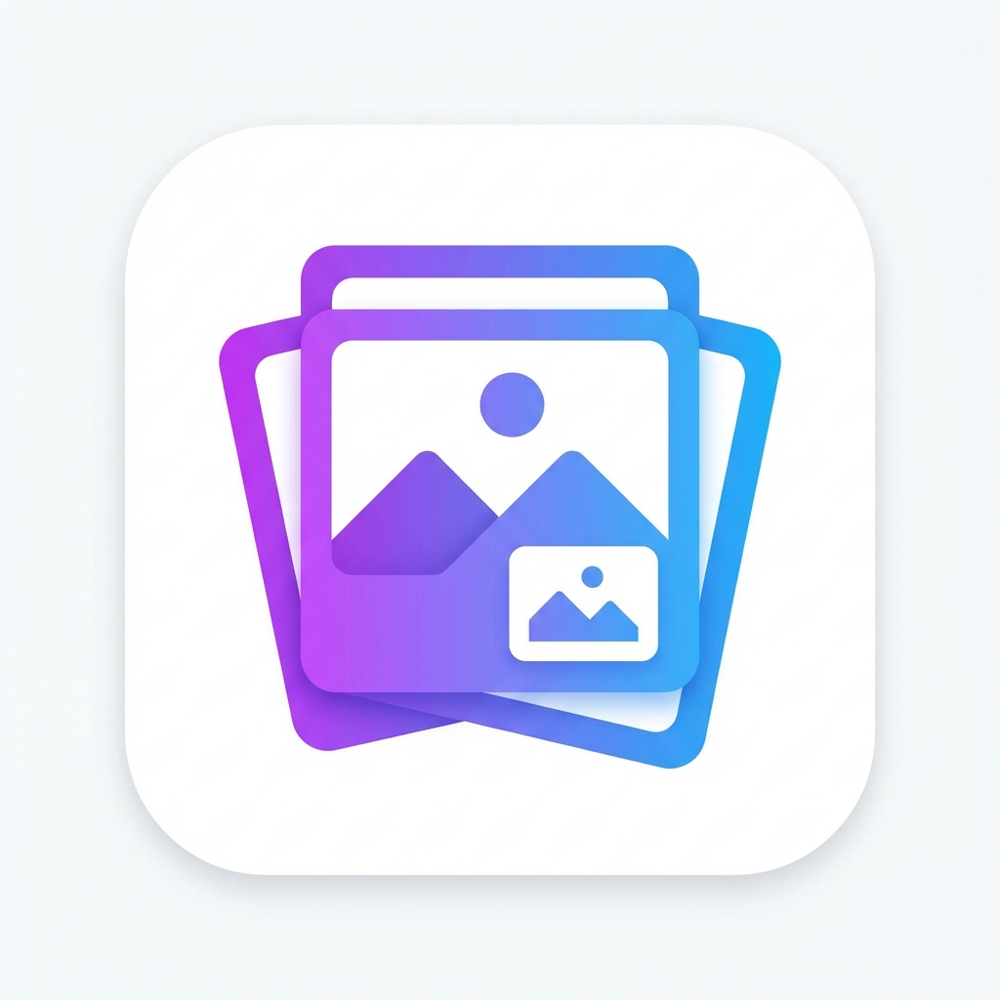

# Image Collector & Downloader

A modern Chrome Extension that extracts all images from any webpage, displays them in an elegant grid interface, and provides powerful download capabilities with advanced filtering options.



## ✨ Features

### Core Functionality
- 🖼️ **Comprehensive Image Detection**
  - Extracts all `` tag images
  - Detects CSS background images
  - Supports `<picture>` and `<source>` elements
  - Automatic duplicate removal

- 📊 **Rich Metadata Display**
  - Image dimensions (width × height)
  - File format (PNG, JPG, WEBP, GIF, SVG, etc.)
  - Visual preview thumbnails
  - Lazy loading for performance

- ⬇️ **Flexible Download Options**
  - Individual image downloads
  - Bulk download selected images as ZIP
  - Smart filename generation
  - Progress indicators

### Advanced Filters
- **Type Filter**: PNG, JPG, WEBP, GIF, SVG
- **Size Filter**: Filter by minimum dimensions (100px, 300px, 500px, 1000px+)
- **Base64 Toggle**: Exclude data URI images

### User Experience
- 🎨 **Modern Dark/Light Mode** with glassmorphism effects
- 📋 **Copy URL** to clipboard with visual feedback
- ✅ **Bulk Selection** with "Select All" toggle
- 💾 **Persistent Preferences** (theme, filter settings)
- 🚀 **Smooth Animations** and responsive design

## 🚀 Installation

### From Source (Development Mode)

1. **Clone or download** this repository:
   ```bash
   git clone <repository-url>
   cd image-downloader
   ```

2. **Open Chrome** and navigate to:
   ```
   chrome://extensions/
   ```

3. **Enable Developer Mode** (toggle in the top right corner)

4. **Click "Load unpacked"** and select the extension directory

5. **Pin the extension** to your toolbar for easy access

### From Chrome Web Store
*Coming soon...*

## 📖 Usage

1. **Navigate** to any webpage with images

2. **Click the extension icon** in your toolbar

3. **Browse images** in the popup grid view
   - Use filters to narrow down results
   - Select individual images or use "Select All"

4. **Download images**:
   - Click individual "Download" buttons
   - Or select multiple and click "Download All" for a ZIP file

5. **Copy URLs**: Click "Copy" to copy image URLs to clipboard

6. **Toggle dark/light mode** using the theme button in the header

## 🛠️ Technical Details

### Architecture
- **Manifest V3** compliant
- **Content Script** (`content.js`): Scans DOM for images
- **Popup Interface** (`popup.html`, `popup.css`, `popup.js`): User interface
- **Service Worker** (`background.js`): Extension lifecycle management
- **JSZip Library**: Bulk download as ZIP archives

### Permissions
- `activeTab`: Access current tab's images
- `downloads`: Download images to disk
- `storage`: Save user preferences
- `<all_urls>`: Access images from any domain

### Browser Compatibility
- ✅ Chrome 88+
- ✅ Edge 88+
- ✅ Brave
- ⚠️ Firefox (requires Manifest V2 adaptation)

## 🎯 Target Users

Perfect for:
- **SEO Professionals** - Analyze competitor image assets
- **Web Designers** - Gather design inspiration
- **Developers** - Debug image loading issues
- **Content Creators** - Collect visual assets
- **Bloggers** - Research image usage

## 📁 Project Structure

```
image-downloader/
├── manifest.json          # Extension configuration
├── popup.html             # Popup interface
├── popup.css              # Styling with dark/light themes
├── popup.js               # UI logic and download handling
├── content.js             # Image detection script
├── background.js          # Service worker
├── lib/
│   └── jszip.min.js      # ZIP library
├── assets/
│   ├── icon16.png
│   ├── icon32.png
│   ├── icon48.png
│   └── icon128.png
└── README.md
```

## 🔮 Future Enhancements

- [ ] Video thumbnail extraction
- [ ] Sort by file size (actual bytes)
- [ ] Export metadata as CSV
- [ ] Cloud storage integration
- [ ] Firefox & Safari support
- [ ] Custom download location
- [ ] Image format conversion
- [ ] Batch rename functionality

## 🐛 Known Issues

- Base64 images may not display file size accurately
- Some cross-origin images may not be downloadable due to CORS policies
- Very large pages (1000+ images) may experience slight performance lag

## 📄 License

MIT License - Feel free to use and modify for personal or commercial projects.

## 🙏 Credits

- **Icons**: Custom SVG icons
- **JSZip**: [Stuk/jszip](https://github.com/Stuk/jszip)
- **Design**: Modern glassmorphism aesthetic

## 💬 Support

For issues, feature requests, or questions:
- Open an issue on GitHub
- Email: [your-email@example.com]

---

**Built with ❤️ for the web development community**
